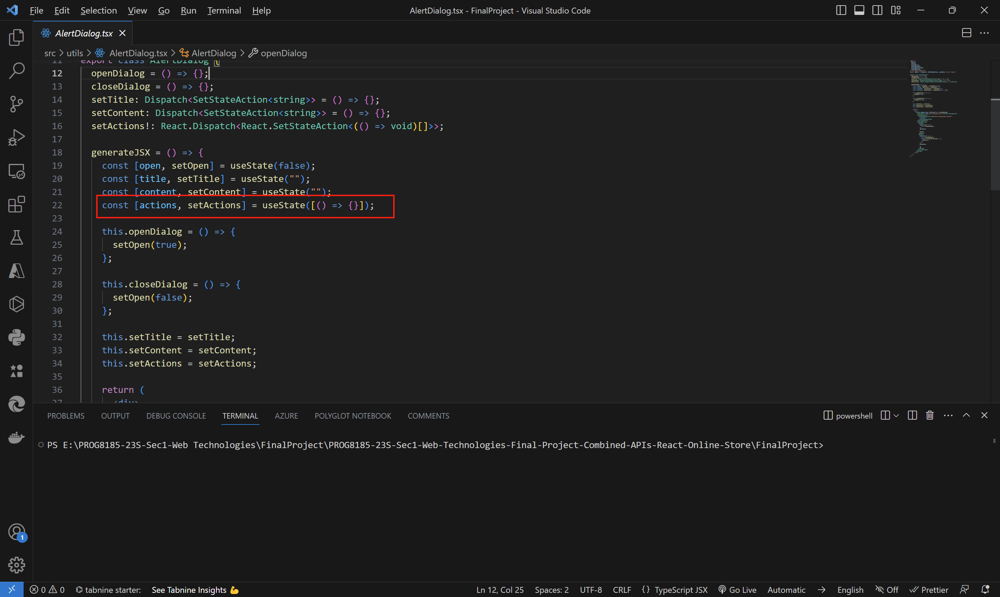
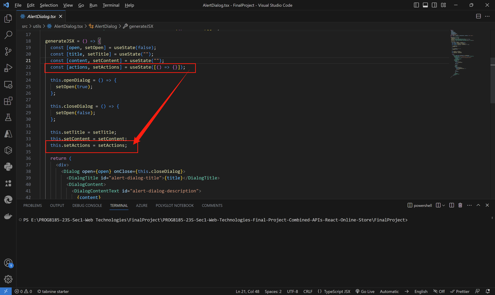
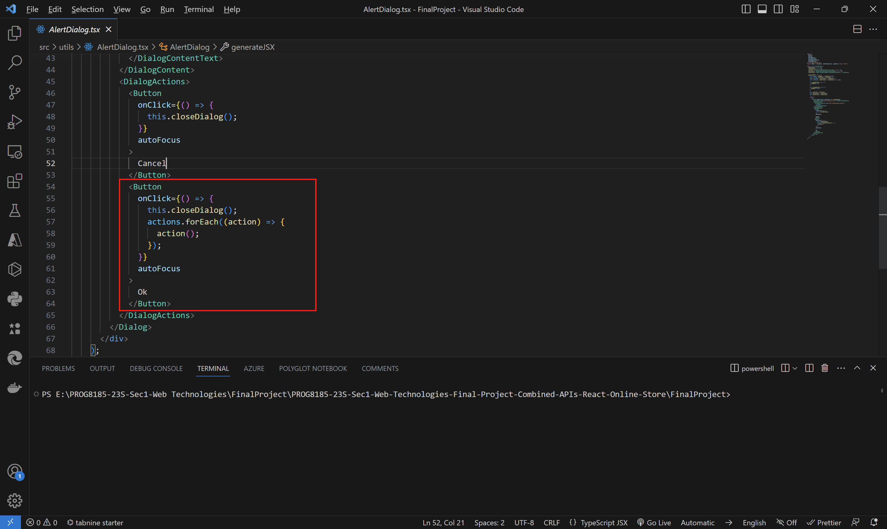
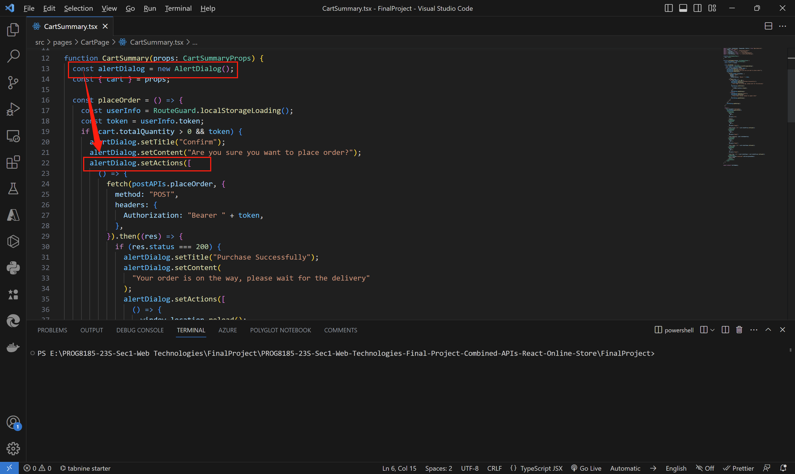
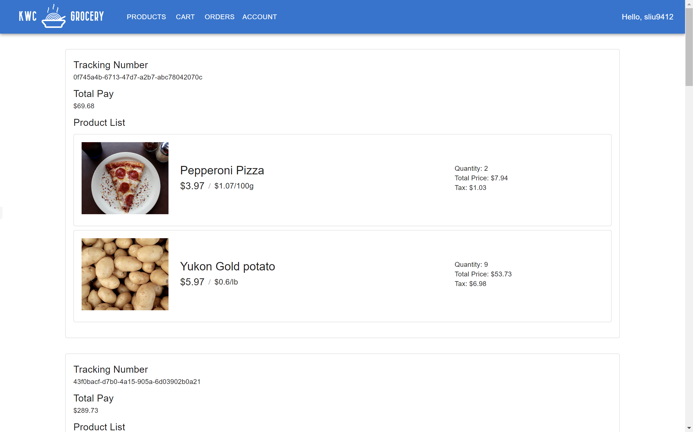
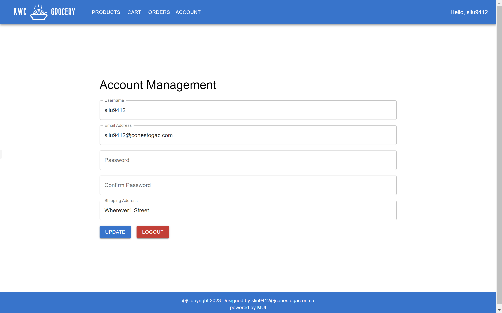
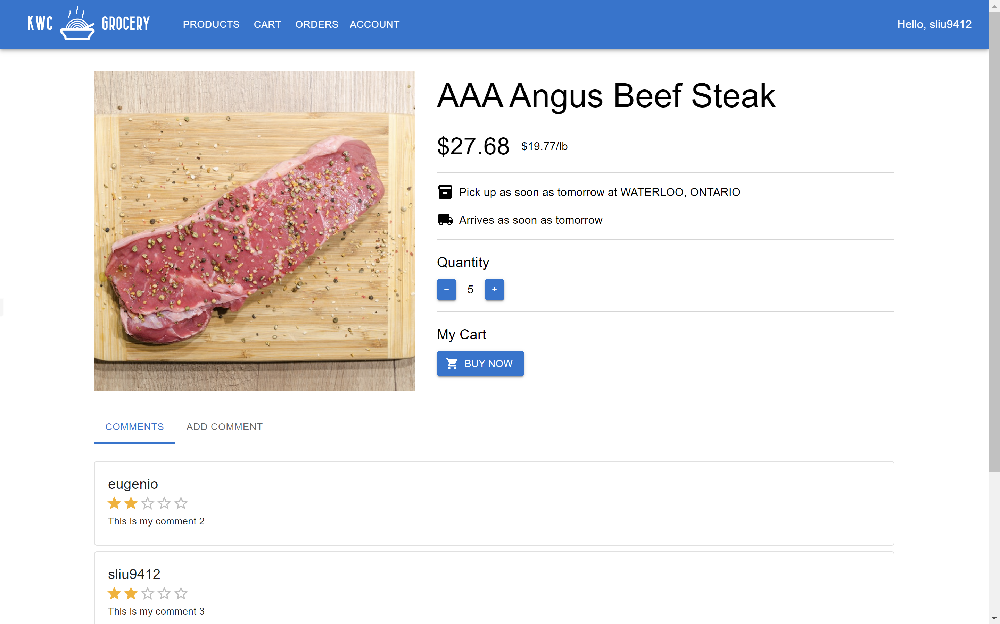

# PROG8185-23S-Sec1-Web-Technologies-Final-Project-Combined-APIs-React-Online-Store

The final project of Conestoga College PROG8185-23S-Sec1 Web Technologies combines the previous projects together, there're 3 optional solutions, using PHP(Assignment2), ASP.NET(Assignment3) or Express.js(Assignment4) as the backend, the Assignment 1 as the demo of frontend.

## Related Project

[https://github.com/sliu9412/PROG8185-23S-Sec1-Web-Technologies-Assignment4-Express.js-Store-APIs](https://github.com/sliu9412/PROG8185-23S-Sec1-Web-Technologies-Assignment4-Express.js-Store-APIs)

## Alert Dialog with Callback Actions

Prepare a pair of state objects, the data type is void function array. The callback functions must be put inside the array, or the single function will be executed while the component is loading, while in the array, there're still the address in the memory.

Make the setState function can be accessed outside the component function.

When tapping the positive button, retrieving the functions of the array and execute them.

The example of binding callback actions.

## Preview

